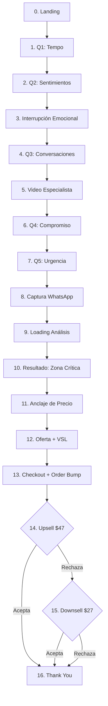

# Diagrama de Fluxo — 17 Telas

Fluxo completo do quiz, da landing à thank you, incluindo bifurcações de upsell e downsell.

## Pontos críticos de conversão

| Tela | Métrica | Meta |
|---|---|---|
| 0 → 1 | Clique no CTA inicial | 60-75% |
| 1 → 8 | Quiz completion | 40-60% |
| 8 → 9 | Form fill (nome + WhatsApp) | 65-80% |
| 12 → 13 | Compra do frontend | 4-8% (cold) |
| 13 (bump) | Order bump take rate | 25-35% |
| 14 → 16 | Upsell take rate | 10-18% |
| 15 → 16 | Downsell take rate (sobre rejeições do upsell) | 20-30% |

## Padrões psicológicos por tela

| Tela | Mecanismo |
|---|---|
| 0 | Social proof (4.9 estrelas, 12.847 mulheres) |
| 2 | Espelhamento de dor (multi-select, "marca todo lo que sientes") |
| 3 | Interrupção emocional + estatística ("73,4%") |
| 5 | Autoridade via persona/método (vídeo HeyGen) |
| 6-7 | Compromisso progressivo (Cialdini) |
| 9 | Teatro de autoridade científica (análise em 4 etapas) |
| 10 | Diagnóstico personalizado + dosagem de medo |
| 11 | Ancoragem de preço (terapia, divórcio) |
| 12 | Stacking de valor ($207 → $27) + garantia + depoimentos |
| 14 | Escassez ("solo una vez") + urgência |
| 15 | Reciprocidade ("entiendo que $47 no era el momento") |

## Tempo médio esperado por tela

| Tela | Segundos |
|---|---|
| 0 (Landing) | 15-30s |
| 1-7 (Quiz) | 10-20s cada |
| 5 (Vídeo) | 180s (3 min) |
| 8 (Captura) | 30-60s |
| 9 (Loading) | 4.2s (fixo) |
| 10 (Resultado) | 60-90s |
| 11 (Ancla) | 45-60s |
| 12 (Oferta) | 240-360s (VSL 4-6min) |
| 13 (Checkout) | 120-300s |
| 14-15 | 60-120s |

**Tempo total estimado:** 12-18 minutos do clique inicial à thank you.
